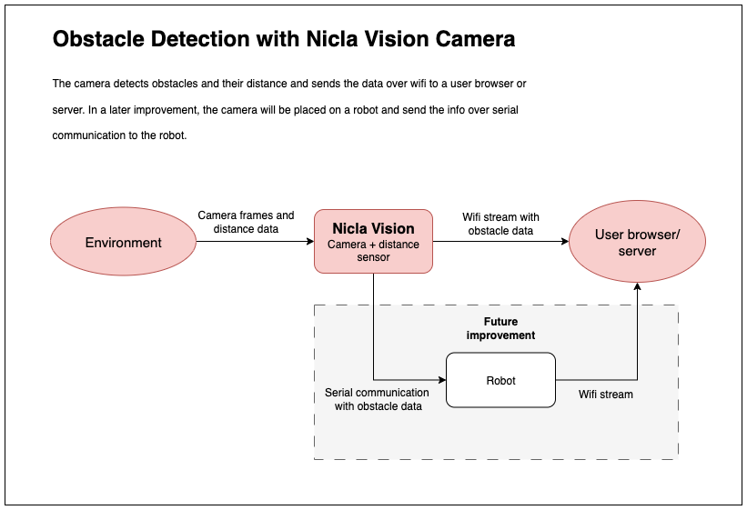

# TTK8 - Object Detection with an Arduino Nicla Vision Camera

This project uses the OpenMV firmware to implement object detection on the Arduino Nicla Vision camera. The system combines blob detection with the integrated distance sensor to identify the nearest object. The object gets marked and the video is streamed over wifi to track obstacles in real-time.


_Object detection on wifi stream_


_Nicla Vision Streaming Video_

**Plot twist:** What started as an innocent object detection project accidentally turned into a fully functional black-and-white home surveillance system. Please use responsibly and with proper consent.

## Features & Configuration


_How the detection system works_

- **Image Capture**: Captures grayscale images at QVGA (320x240) resolution

```python
sensor.set_pixformat(sensor.GRAYSCALE)  # grayscale for detection
sensor.set_framesize(sensor.QVGA) # smaller frame size for speed
```

- **Distance Measurement**: Uses the integrated ToF VL53L1X sensor. Defines a valid range from 40mm to 2000mm.

```python
MIN_VALID_DISTANCE = 40  # mm
MAX_VALID_DISTANCE = 2000 # mm
```

- **Real-time Blob Detection**: Identifies dark objects (blobs) standing out from the background. The `color_threasholds` are recalculated at every capture based on the average background brightness to handle varying lighting conditions.

```python
# Find dark blobs
blobs = img.find_blobs(color_thresholds, pixels_threshold=min_pixels, area_threshold=min_area)

```

- **Target Selection & Tracking**: Prioritizes blobs nearest the distance sensor's line-of-sight (center), where the sensor most accurate. Ignores objects that are too small or too large to reduce false positives.

- **Visualization**: Draws box around nearest obstacle and displays distance information on live feed

## Prerequisites

### 1. Hardware Requirements

- [Arduino Pro Nicla Vision](https://store.arduino.cc/products/nicla-vision?srsltid=AfmBOopppHsPMesp0YKIOC7XfsJXBv7hgtYOzXum65FR8MvuUogarmM3)
- USB micro-b cable for programming and power
- WiFi network with a 2.4GHz bandwidth for streaming
- Computer (windows/linux/mac)


_Arduino Pro Nicla Vision_

### 2. Install OpenMV IDE

Download & install [OpenMV IDE](https://openmv.io/pages/download?srsltid=AfmBOor3aI8hPW_sCZ0YLRZqzcMkT7fHTG1KMVlt2jVWwqs6_waVNAJy) (Windows/Linux/Mac).

1. Connect your Nicla Vision via USB to your computer
2. Open the OpenMV IDE and connect the camera by clicking the outlet icon (Ctrl+E). The play button turns green when connected.


3. It will prompt you to update firmware → install OpenMV firmware on the Nicla Vision
4. Test by running an example: File → Examples → OpenMV → HelloWorld

## How to Run

### Without Wifi Streaming

1. Open `ttk8.py` in OpenMV IDE and set `ENABLE_WIFI_STREAMING` to False.
2. Connect your Nicla Vision to the computer with a USB cable and hit play - it automatically starts object detection and the led turns green. The stream is shown in OpenMV.


### With wifi streaming

1. Open `ttk8.py` in OpenMV IDE and modify these parameters. Ensure your wifi supports the 2.4 GHz band:

```python
ENABLE_WIFI_STREAMING = True # Or False to disable wifi streaming
WIFI_NAME = "your_network_name"
WIFI_KEY = "your_password"
```

This is where the most problems occurred. See [Troubleshooting](#troubleshooting) for solutions.

2. Connect your Nicla Vision to the computer with a USB cable. In the OpenMV IDE click connect (outlet icon) and hit play. The light turns blue during the network setup.


3. The output in the terminal will tell you to open a browser and access the stream at a certain ip and port. When this is done, the stream starts and the light turns green.


4. When the stream works, upload the code to the Nicla Vision. This is done in OpenMV by selecting Tools->Save open script to OpenMV Cam


5. Disconnect the camera from the computer and connect it to a power source. This can be an outlet or a battery connected to the nicla vision power pins.

   - The camera will automatically connect to the specified network and the light is blue.
   - Open a browser and navigate to the stream, the light turns green when streaming. The stream does not start untill a browser is opened.
   - View the live stream with obstacle detection.

     

#### Troubleshooting Wifi Connection

1. Test [with wifi streaming](#with-wifi-streaming), while having the camera connected to the computer. Then you can see the terminal output in OpenMV and use it for debugging.
1. Check that your network supports the 2.4 GHz band.
   On mac: Option + click on wifi icon. Check the network bandwidth under "Channel".
   On windows: Open Settings → Network & Internet → Wi-Fi. Click on your current network name and look for network band.
1. If your network does not support the 2.4 GHz band, the easiest solution is to go to your router ip and enable a 2G network. To find the router ip, run `arp -a` in the mac terminal. One of the ips listed will be you router. Open a browser and go to the router ip. Check your physical router box for the password. Then you can enable a 2G network with WPA2 encryption.
1. Another solution is to connect your computer to ethernet, and enable a mobile hotspot (selecting the 2.4 GHz band).
1. If your browser blocks the HTTP stream (showing "Not Secure" warning), click "Advanced" on the security warning and select "Proceed to [IP address] (unsafe)". Your browser might have further restrictions, denying you access.

## Results and Examples

Lagging, lighter objects not working, lighting matters, darker object behind will be seen as closest even if its not.

### Detection Performance

#### Dark Object Detection

**Current Status**: Working

Selects the object closest to the center of the image, where the distance sensor is the most accurate.


_Dark object detection with distance measurement_

#### Bright Object Detection

**Current Status**: Not supported. Not working.

**Issue**: The system only detects dark objects. In the example image, light-colored glasses are placed in front of a dark chair, but the algorithm incorrectly identifies the chair as the closest obstacle because:

- It prioritizes dark objects over bright ones
- The chair is closer than the dark plant to the image center (where the distance sensor is most accurate)

**Design Decision**: Earlier code versions included a toggle between dark and bright object detection. However, bright object detection frequently misidentified walls, windows, and background elements as targets instead of actual objects of interest. To improve reliability, the feature was removed and the system now focuses exclusively on dark object detection.


_Bright object detection example_

#### Multiple Objects

**Current Status**: Works sometimes


_Live video demonstration of multiple object detection_

**Issue**: The system struggles with stability when multiple objects are present. It frequently switches between detected objects because the algorithm cannot accurately determine which object is actually closest - it only identifies which object is closest to the center and dark relative to the background. When the camera moves or lighting conditions change slightly, the detected "closest" object switches unpredictably between the available targets. This creates an unstable detection that jumps between objects rather than consistently tracking the genuinely nearest obstacle.

### Distance Measurement Accuracy

**Limitation**: The camera has a single ToF distance sensor that measures distance at the center point only. This creates the illusion that the entire image has the same depth as the center point. While the distance reading is accurate when the closest object lies in the center, it might not precisely reflect the distance when the closest object it positioned elsewhere.

#### Close Range Performance

- **Minimum distance**: 40mm (4cm) as specified in the [VL53L1X datasheet](https://www.st.com/resource/en/datasheet/vl53l1x.pdf)
- **Issue**: Objects placed closer than 40mm cause distance readings to increase rather than decrease and are unreliable

#### Long Range Performance

- **Maximum range**: Up to 4m theoretically, limited to 2m in implementation
- **Hardware limitation**: Performance degrades in low-light conditions per [VL53L1X datasheet](https://www.st.com/resource/en/datasheet/vl53l1x.pdf)
- **Algorithm limitation**: At longer distances, the blob detection algorithm struggles to accurately identify which detected object corresponds to the distance measurement from the center-point sensor

### Streaming Performance

**Current Status**: The WiFi stream experiences intermittent lag that, while manageable, can impact user experience during real-time monitoring.

**Lag Sources**: Stream lag occurs due to multiple factors:

- **Network limitation**: Required use of 2.4GHz WiFi band limits bandwidth
- **Processing overhead**: Real-time image calculations (blob detection, distance measurement, visualization) consume significant processing power
- **Image transmission**: Converting and streaming frames over HTTP adds latency

**Optimization Strategy**: To improve streaming performance, several compromises were made:

- **Grayscale format**: Reduces data size compared to color images
- **QVGA resolution**: Lower 320x240 resolution decreases processing time and transmission bandwidth
- **Reduced JPEG quality**: Compressed image quality balances stream responsiveness with visual clarity

**Trade-off**: There's a balance between maintaining smooth streaming performance and preserving enough image quality for accurate object detection and analysis.

## Future Improvements

The end goal is to provide stable obstacle info for avoidance. Implementing a function that provides the average of recent positions and distance measurements could improve consistency and reliability. Although large distance variations may cause instability in the averaged results.

The wifi stream lags at times and requires stable wifi, which makes it vulnerable. In a future improvement, only sending the obstacle info over serial communication would be beneficial.



## Tips n Tricks

If you want to divide the code into multiple files using OpenMV, you will get include errors.

To surpass this, you will need to move the files you want to include directly onto the Nicla Vision camera's internal storage drive (not your computer's drive). When the camera is connected via USB, it appears as a separate USB drive in your file explorer - copy the Python files you want include there.
