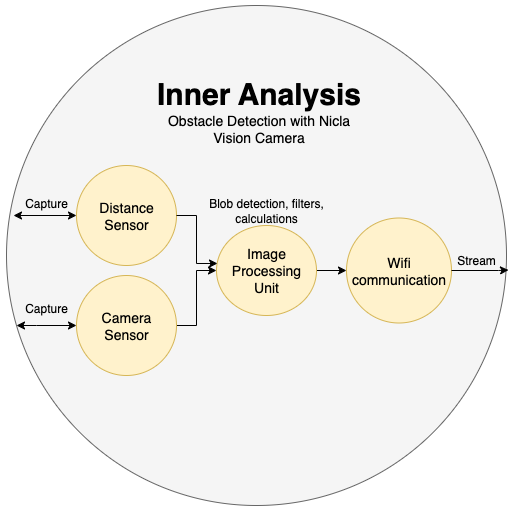

# TTK8 - Object Detection with an Arduino Nicla Vision Camera (Spy Camera)

This project uses the OpenMV firmware to implement object detection on the Arduino Nicla Vision camera. The system combines blob detection with the integrated distance sensor to identify the nearest object. The object gets marked and the video is streamed over wifi to track obstacles in real-time.

**Plot twist:** What started as an innocent object detection project accidentally evolved into a fully functional black-and-white surveillance system! During testing, it was discovered that this works suspiciously well as a home security or spy camera (please use responsibly and with proper consent - privacy matters!). Who knew that "detecting obstacles" could also mean "detecting your roommate eating snacks at 2 AM"?


_Nicla Vision camera system_

## Prerequisites

### 1. Hardware Requirements

- [Arduino Pro Nicla Vision](https://store.arduino.cc/products/nicla-vision?srsltid=AfmBOopppHsPMesp0YKIOC7XfsJXBv7hgtYOzXum65FR8MvuUogarmM3)
- USB micro-b cable for programming and power
- WiFi network with a 2.4GHz bandwidth for streaming (optional)
- Computer (windows/linux/mac)


_Arduino Pro Nicla Vision with USB connection_

### 2. Install OpenMV IDE

Download & install [OpenMV IDE](https://openmv.io/pages/download?srsltid=AfmBOor3aI8hPW_sCZ0YLRZqzcMkT7fHTG1KMVlt2jVWwqs6_waVNAJy) (Windows/Linux/Mac).

1. Connect your Nicla Vision via USB
2. Open the OpenMV IDE and connect the camera by clicking the outlet icon (Ctrl+E)
3. It will prompt you to update firmware → install OpenMV firmware on the Nicla Vision
4. Test by running an example: File → Examples → OpenMV → Image Processing

## Features & Algorithm

- **Image Capture**: Captures grayscale images at QVGA resolution
- **Real-time Blob Detection**: Identifies and filters dark/bright objects standing out from the background
- **Adaptive Thresholding**: Calculates mean background brightness to handle varying lighting conditions
- **Target Selection & Tracking**: Prioritizes objects in the center of the field of view, where the distance sensor is most accurate. Ignores objects that are too small or too large to reduce false positives
- **Distance Measurement**: Uses integrated ToF sensor for precise distance readings
- **Visualization**: Draws box around nearest obstacle and displays distance information on live feed
- **WiFi Streaming**: Optional live video streaming to web browser for remote monitoring (hence spy camera)


_Example of object detection with distance measurement overlay_

## Configuration

### Camera Settings

- **Format**: Grayscale (optimized for detection)
- **Resolution**: QVGA (320x240)

### Detection Parameters

```python
THRESHOLD_TYPE = "dark"      # "dark" or "bright" objects
OFFSET = 30                  # Threshold offset from mean brightness
min_area = 300              # Minimum blob area (pixels)
min_pixels = 300            # Minimum blob pixel count
max_fraction = 0.95         # Maximum blob size (95% of image)
MIN_VALID_DISTANCE = 40     # Minimum valid ToF reading (mm)
```

### WiFi Configuration

To enable WiFi streaming, modify these parameters in `ttk8.py` and ensure your wifi supports the 2.4 GHz band:

```python
ENABLE_WIFI_STREAMING = True # Or False to disable wifi streaming
WIFI_NAME = "your_network_name"
KEY = "your_password"
```

This is where the most problems occurred. See [Troubleshooting](#troubleshooting) for solutions.


_OpenMV IDE interface with ttk8.py loaded and connected to Nicla Vision_

## How to Run

### Without Wifi Streaming

1. Open `ttk8.py` in OpenMV IDE and set 'ENABLE_WIFI_STREAMING' to False.
2. Connect your Nicla Vision to the computer with a USB cable. In the OpenMV IDE click connect (outlet icon) and hit play - it will automatically start object detection

### With wifi streaming

1. Open `ttk8.py` in OpenMV IDE and set `ENABLE_WIFI_STREAMING` to True.
2. Configure the WiFi parameters (`WIFI_NAME` and `KEY`) as described in the [WiFi Configuration](#wifi-configuration) section. Make sure your WiFi supports 2.4 GHz band.
3. Connect your Nicla Vision to the computer with a USB cable. In the OpenMV IDE click connect (outlet icon) and hit play - it will tell you to open a browser and access the stream at http://192.168.1.30:8080/
4. When the stream works, upload the code to the Nicla Vision by selecting Tools->Save open script to OpenMV Cam
5. Disconnect the camera from the computer and connect it to a power source
   - The camera will automatically connect to the specified network
   - Open a browser and navigate to the stream http://192.168.1.30:8080/ The stream does not start unless a browser is opened.
   - View the live stream with obstacle detection.


_Live video stream in web browser showing real-time object detection_


_Visual representation of the detection algorithm workflow_

#### Troubleshooting

1. Test [with wifi streaming](#with-wifi-streaming), while having the camera connected to the computer. Then you can see the terminal output in OpenMV and use it for debugging.
2. Check that your network supports the 2.4 GHz band.
   On mac: Option + click on wifi icon. Check the network bandwidths under `Channel`.
   On windows: Open Settings → Network & Internet → Wi-Fi. Click on your current network name and look for network band.
3. If your network does not support the 2.4 GHz band, a solution is to connect your computer to ethernet, and enable its mobile hotspot (selecting the 2.4 GHz band).
4. If your browser blocks the HTTP stream (showing "Not Secure" warning), click "Advanced" on the security warning and select "Proceed to [IP address] (unsafe)". Your browser might have further restrictions, denying you access.

## Results and Examples

### Detection Performance


_Dark object detection with distance measurement_


_Bright object detection example_


_Handling multiple objects in the field of view_

### Different Lighting Conditions


_Object detection in low light conditions_


_Object detection under bright lighting_

### Distance Measurement Accuracy


_Distance measurement accuracy demonstration_


_Close range object detection (minimum 40mm)_


_Long range object detection capabilities_

## Multiple Files

If you want to divide the code into multiple files using OpenMV, you will get include errors.

To surpass this, you will need to move the files you want to include directly onto the Nicla Vision camera's internal storage drive (not your computer's drive). When the camera is connected via USB, it appears as a separate USB drive in your file explorer - copy the Python files you want include there.
