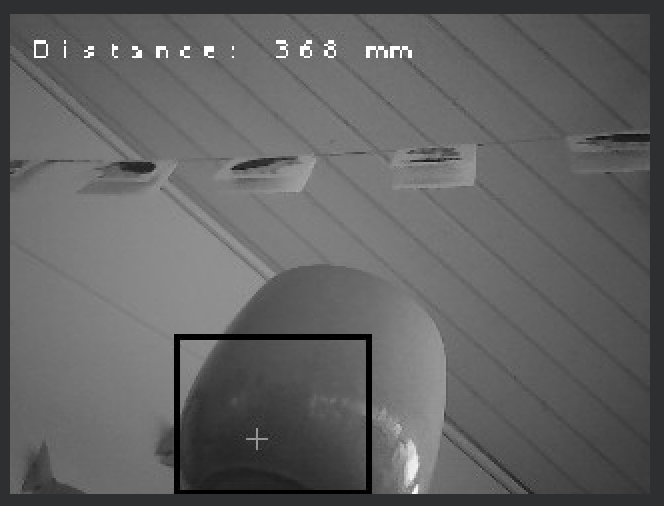
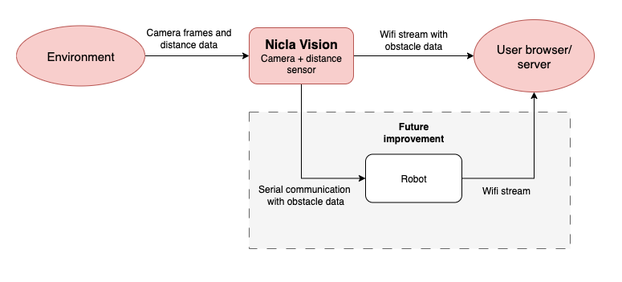
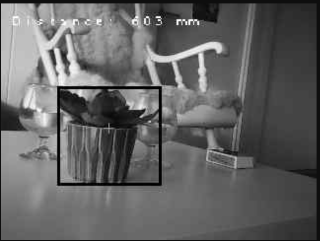
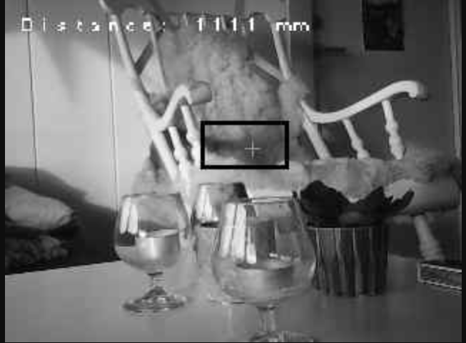
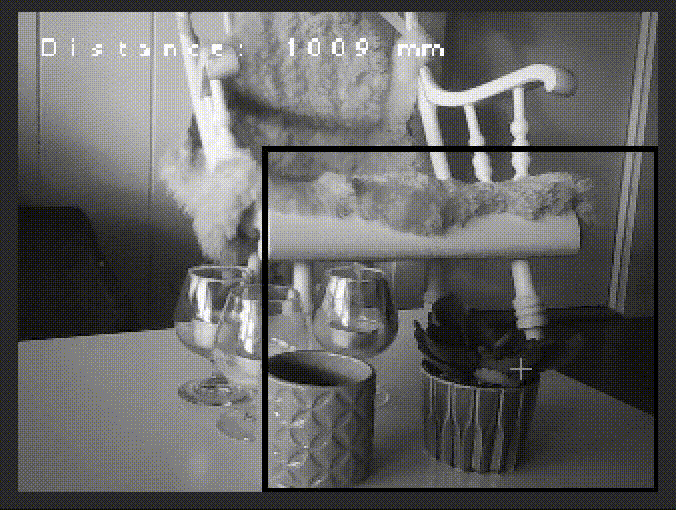
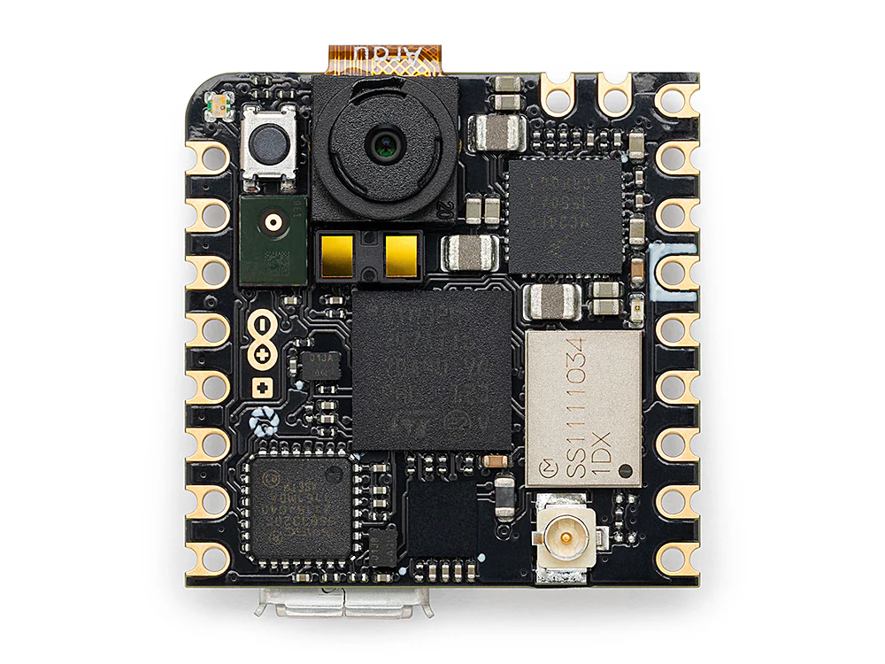
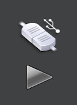
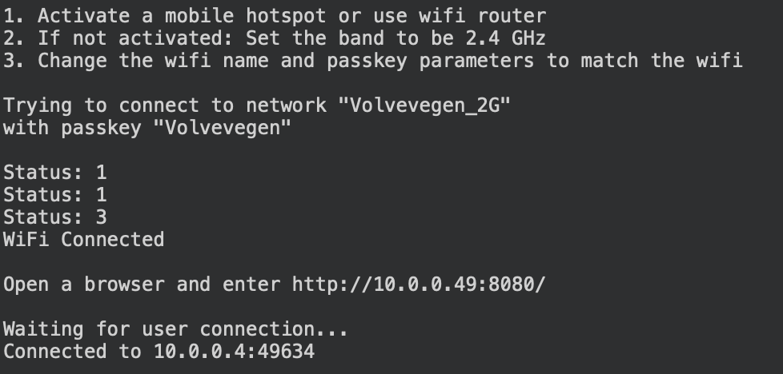
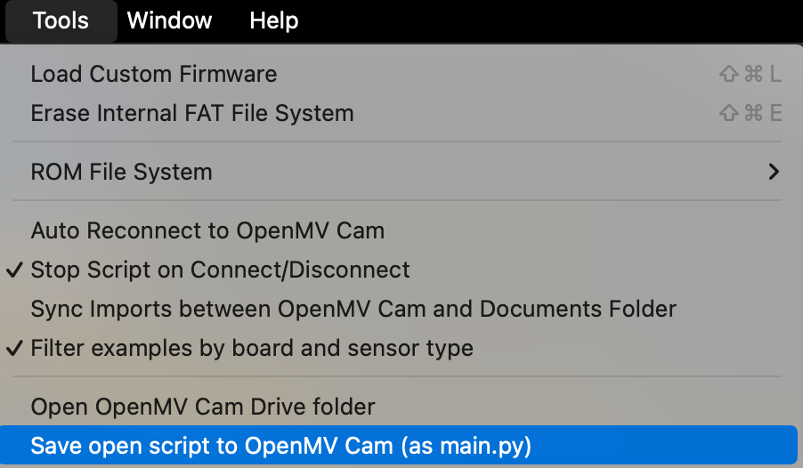

# Object Detection with an Arduino Nicla Vision Camera

Course: TTK8  
Year: 2025  
Student: Rebekka Alve

## 1. Summary
This project implements a real-time obstacle detection system on an Arduino Nicla Vision using OpenMV firmware. It detects dark objects using blob detection and reads the distance from the integrated ToF sensor. The information is transmitted as camera frames over 2.4 GHz Wi-Fi, with an overlaying bounding box and distance on the frame, marking the closest obstacle.

The algorithm worked reliably for single dark objects in many conditions. The support for bright objects was removed because of too many false positives (walls, windows, etc). For multiple dark objects, the selection was unstable, but working. The distance measured was accurate when the target was centered, and not as accurate if off-center. The stream had some lag and tradeoffs (grayscale, QVGA, JPEG quality) had to be done to improve streaming responsiveness at the cost of image and detection accuracy.


_Nicla Vision Streaming Video_



_Object detection on wifi stream_

**Plot twist:** What started as an object detection project accidentally turned into a fully functional black-and-white home surveillance system. Please use responsibly and with proper consent.

## Table of Contents

1. [Summary](#summary)
2. [Table of Contents](#table-of-contents)
3. [List of Abbreviations](#list-of-abbreviations)
4. [Future Improvements](#future-improvements)
5. [Success critera](#success-critera)
6. [System Architecture](#system-architecture)

   6.1 [Overview](#overview)

   6.2 [Algorithm](#algorithm)
   
   6.3 [Communication](#communication)

7. [Results and System Performance](#results-and-system-performance)
   
   7.1 [Object detection Performance](#object-detection-performance)
       
      - 7.1.1 [Single Dark Object Detection](#single-dark-object-detection)
      - 7.1.2 [Bright Object Detection](#bright-object-detection)
      - 7.1.3 [Multiple Objects](#multiple-objects)
   
   7.2 [Distance Measurement Accuracy](#distance-measurement-accuracy)
       
      - 7.2.1 [Close Range Performance](#close-range-performance)
      - 7.2.2 [Long Range Performance](#long-range-performance)
   
   7.3 [Streaming Performance](#streaming-performance)

8. [Prerequisites](#prerequisites)
   
   8.1 [Hardware Requirements](#1-hardware-requirements)
   
   8.2 [Install OpenMV IDE](#2-install-openmv-ide)

9. [How to Run](#how-to-run)
   
   9.1 [Without Wifi Streaming](#without-wifi-streaming)
   
   9.2 [With wifi streaming](#with-wifi-streaming)
   
   9.3 [Troubleshooting Wifi Connection](#troubleshooting-wifi-connection)

10. [Tips n Tricks](#tips-n-tricks)
11. [Appendix / References](#appendix--references)

## List of Abbreviations

- ToF — Time‑of‑Flight (distance sensor, e.g., VL53L1X)  
- QVGA — Quarter VGA (320 × 240 resolution)  
- FPS — Frames Per Second  
- Wi‑Fi — Wireless Fidelity (2.4 GHz network used for streaming)  
- OpenMV — OpenMV firmware / platform (used on Nicla Vision)  
- IDE — Integrated Development Environment (OpenMV IDE)  
- Nicla — Arduino Nicla Vision (camera module)  
- USB — Universal Serial Bus (programming / power connection)  
- HTTP — HyperText Transfer Protocol (used for browser streaming)  
- JPEG — Joint Photographic Experts Group (image compression format used for streaming)  
- WPA2 — Wi‑Fi Protected Access II (wireless network security)  
- IP — Internet Protocol (address used to access the stream)  
- DHCP — Dynamic Host Configuration Protocol (network IP assignment)  
- mm — millimetre(s) (distance unit)  
- VL53L1X — STMicroelectronics ToF distance sensor model


## Future Improvements
The Nicla Vision camera is intended to be mounted on a mobile robot in a larger project: detected obstacles and distance readings will be sent to the robot's control system to enable obstacle avoidance behaviors (stop, steer around, or re-route).

In the future development, only sending the obstacle info (distance and size) over serial communication will be beneficial, as streaming might lag and is vulnreable to unstable wifi connection. In addition, the robots already use wifi to communicate with the robot server, which might complicate camera communication over wifi.



## Success critera

1. Deliverables

   1.1. Working Nicla Vision script -> yes

   1.2. Step‑by‑step setup instructions (firmware update, upload, network setup) -> yes

   1.3. Test results with examples and analysis -> yes


2. Success criteria

   2.1. Reliable detection of the nearest dark object -> sometimes

   2.2. Reliable distance readings within the specified accuracy range -> yes

   2.3. Continuous Wi‑Fi streaming -> mostly


## System Architecture

### Overview
The system consists of an integrated distance and camera sensor on the Nicla Vision, which also executes the object detection algorithm. This is then sent over the connected wifi to a specified port and an available IP address.


_Detection system architecture_

### Algorithm
An algorithm had to be chosen for detecting obstacles and sending the information to a user or server. Blob detection was chosen as the detection algorithm, because it is lightweight, fast and easy to tune for high‑contrast (dark) objects. It runs efficiently on the OpenMV / Nicla platform compared to heavier ML methods, which helps maintain real‑time FPS and reduces power use. Blob detection works by defining ´´Dark´´ as the average background brightness pluss an offset and grouping objects of the same luminissense together into blobs. To handle changing lighting, the background brightness is recalculated every frame, improving reliability without complex preprocessing. An issure occurred when there were several blobs or obstacles, because there was no real way of telling which was closest to the camera. A solution was to prioritize blobs near the image center, where the ToF sensor line-of-sight is.

Having chosen blob detection further motivated using grayscale, because it reduces the data size and preserves luminance contrast, which is what the blob detector uses. Processing grayscale frames is faster and requires less memory/CPU than color, improving real‑time performance on the Nicla Vision. QVGA (320×240) resolution was chosen as a compromise between spatial detail and throughput, because it gives enough image resolution for obstacle detection while keeping processing and network transmission load low to meet FPS targets.

### Communication

Wi‑Fi streaming was chosen as the communication medium primarily for convenience and out curiosity. The distance and a bounding box is drawn onto each wifi frame, marking the nearest object and its proximity. This seemed the easiest way to visualize and validate the obstacle detection in a browser during development and demonstrations. However it adds latency and can be unstable. The bandwitdth is litmited to 2.4 GHz, which limits the JPEG quality that can be transmitted. For later robot integration, a simple serial transmission of obstacle data (distance + object size/position) is recommended.

## Results and System Performance
This section is divided in three parts; object detection performance, distance accuracy and Wi-Fi streaming performance, and evaluates the success critera in relation to each part.

### Object detection Performance

#### Single Dark Object Detection

Current Status: Working

Selects the object closest to the center of the image, where the distance sensor is the most accurate.



_Dark object detection with distance measurement_

#### Bright Object Detection

Current Status: Not supported. Not working.

**Issue**: The system only detects dark objects. In the example image below, light-colored glasses are placed in front of a dark chair, but the algorithm incorrectly identifies the chair as the closest obstacle because:

- It prioritizes dark objects over bright ones
- The chair is closer than the dark plant to the image center (where the distance sensor is most accurate)

**Design Decision**: Earlier code versions included a toggle between dark and bright object detection. However, bright object detection frequently misidentified walls, windows, and background elements as targets instead of actual objects of interest. To improve reliability, the feature was removed and the system now focuses exclusively on dark object detection.



_Bright object detection example_

#### Multiple Objects

Current Status: Works sometimes



_Live video demonstration of multiple object detection_

**Issue**: The system struggles with stability when multiple objects are present. It frequently switches between different objects because the algorithm cannot accurately determine which object is actually closest - it only identifies which object is closest to the image center and dark relative to the background. When the camera moves or lighting conditions change slightly, the detected "closest" object switches unpredictably between the available targets. This creates an unstable detection that jumps between objects rather than consistently tracking the genuinely nearest obstacle.

### Distance Measurement Accuracy

**Limitation**: The camera has a single ToF distance sensor that measures distance at the center point only. This creates the illusion that the entire image has the same depth as the center point. While the distance reading is accurate when the closest object lies in the center, it might not precisely reflect the distance when the closest object it positioned elsewhere.

#### Close Range Performance

- **Minimum distance**: 40mm (4cm) as specified in the [VL53L1X datasheet](https://www.st.com/resource/en/datasheet/vl53l1x.pdf)
- **Issue**: Objects placed closer than 40mm cause distance readings to increase rather than decrease and are unreliable

#### Long Range Performance

- **Maximum range**: Up to 4m theoretically, limited to 2m in implementation
- **Hardware limitation**: Performance degrades in low-light conditions per [VL53L1X datasheet](https://www.st.com/resource/en/datasheet/vl53l1x.pdf)
- **Algorithm limitation**: At longer distances, the blob detection algorithm struggles to accurately identify which detected object corresponds to the distance measurement from the center-point sensor

### Streaming Performance

**Current Status**: The WiFi stream experiences intermittent lag that, while manageable, can impact user experience during real-time monitoring.

**Lag Sources**: Stream lag occurs due to multiple factors:

- **Network limitation**: Required use of 2.4GHz WiFi band limits bandwidth
- **Processing overhead**: Real-time image calculations (blob detection, distance measurement, visualization) consume significant processing power
- **Image transmission**: Converting and streaming frames over HTTP adds latency

**Optimization Strategy**: To improve streaming performance, several compromises were made:

- **Grayscale format**: Reduces data size compared to color images
- **QVGA resolution**: Lower 320x240 resolution decreases processing time and transmission bandwidth
- **Reduced JPEG quality**: Compressed image quality balances stream responsiveness with visual clarity

**Trade-off**: There's a balance between maintaining smooth streaming performance and preserving enough image quality for accurate object detection and analysis.


## Prerequisites

### 1. Hardware Requirements

- [Arduino Pro Nicla Vision](https://store.arduino.cc/products/nicla-vision?srsltid=AfmBOopppHsPMesp0YKIOC7XfsJXBv7hgtYOzXum65FR8MvuUogarmM3)
- USB micro-b cable for programming and power
- WiFi network with a 2.4GHz bandwidth for streaming
- Computer (windows/linux/mac)



_Arduino Pro Nicla Vision_

### 2. Install OpenMV IDE

Download & install [OpenMV IDE](https://openmv.io/pages/download?srsltid=AfmBOor3aI8hPW_sCZ0YLRZqzcMkT7fHTG1KMVlt2jVWwqs6_waVNAJy) (Windows/Linux/Mac).

1. Connect your Nicla Vision via USB to your computer
2. Open the OpenMV IDE and connect the camera by clicking the outlet icon (Ctrl+E). The play button turns green when connected.




3. It will prompt you to update firmware → install OpenMV firmware on the Nicla Vision
4. Test by running an example: File → Examples → OpenMV → HelloWorld

## How to Run

### Without Wifi Streaming

1. Open `ttk8.py` in OpenMV IDE and set `ENABLE_WIFI_STREAMING` to False.
2. Connect your Nicla Vision to the computer with a USB cable and hit play - it automatically starts object detection and the led turns green. The stream is shown in OpenMV.


### With wifi streaming

1. Open `ttk8.py` in OpenMV IDE and modify these parameters. Ensure your wifi supports the 2.4 GHz band:

```python
ENABLE_WIFI_STREAMING = True # Or False to disable wifi streaming
WIFI_NAME = "your_network_name"
WIFI_KEY = "your_password"
```

This is where the most problems occurred. See [Troubleshooting](#troubleshooting) for solutions.

2. Connect your Nicla Vision to the computer with a USB cable. In the OpenMV IDE click connect (outlet icon) and hit play. The light turns blue during the network setup.


3. The output in the terminal will tell you to open a browser and access the stream at a certain ip and port. When this is done, the stream starts and the light turns green.




4. When the stream works, upload the code to the Nicla Vision. This is done in OpenMV by selecting Tools->Save open script to OpenMV Cam



5. Disconnect the camera from the computer and connect it to a power source. This can be an outlet or a battery connected to the nicla vision power pins.

   - The camera will automatically connect to the specified network and the light is blue.
   - Open a browser and navigate to the stream, the light turns green when streaming. The stream does not start untill a browser is opened.
   - View the live stream with obstacle detection.

     

#### Troubleshooting Wifi Connection

1. Test [with wifi streaming](#with-wifi-streaming), while having the camera connected to the computer. Then you can see the terminal output in OpenMV and use it for debugging.
1. Check that your network supports the 2.4 GHz band.
   On mac: Option + click on wifi icon. Check the network bandwidth under "Channel".
   On windows: Open Settings → Network & Internet → Wi-Fi. Click on your current network name and look for network band.
1. If your network does not support the 2.4 GHz band, the easiest solution is to go to your router ip and enable a 2G network. To find the router ip, run `arp -a` in the mac terminal. One of the ips listed will be you router. Open a browser and go to the router ip. Check your physical router box for the password. Then you can enable a 2G network with WPA2 encryption.
1. Another solution is to connect your computer to ethernet, and enable a mobile hotspot (selecting the 2.4 GHz band).
1. If your browser blocks the HTTP stream (showing "Not Secure" warning), click "Advanced" on the security warning and select "Proceed to [IP address] (unsafe)". Your browser might have further restrictions, denying you access.


## Tips n Tricks

If you want to divide the code into multiple files using OpenMV, you will get include errors.

To surpass this, you will need to move the files you want to include directly onto the Nicla Vision camera's internal storage drive (not your computer's drive). When the camera is connected via USB, it appears as a separate USB drive in your file explorer - copy the Python files you want include there.

## Appendix / References

- [Arduino Nicla Vision datasheet](https://docs.arduino.cc/hardware/nicla-vision/)
- [Arduino Nicla Vision blob detection toturial](https://docs.arduino.cc/tutorials/nicla-vision/blob-detection/)
- [Arduino Nicla Vision wifi streaming toturial](https://docs.arduino.cc/tutorials/nicla-vision/live-streaming/)
- [TOF distance sensor VL53L1X Datasheet](https://www.st.com/resource/en/datasheet/vl53l1x.pdf)
- [OpenMV Documentation](https://docs.openmv.io/)
